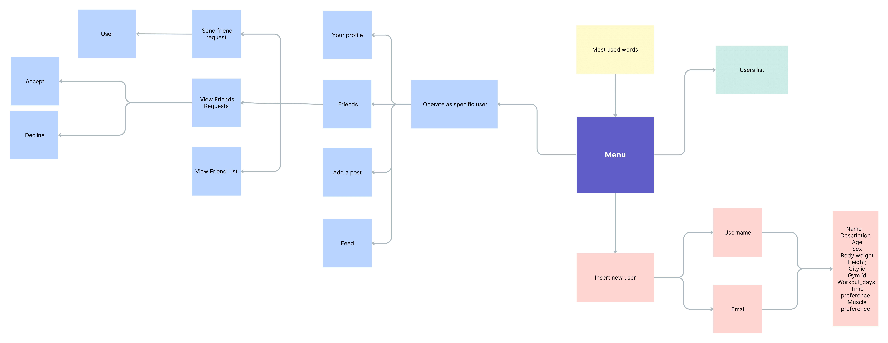
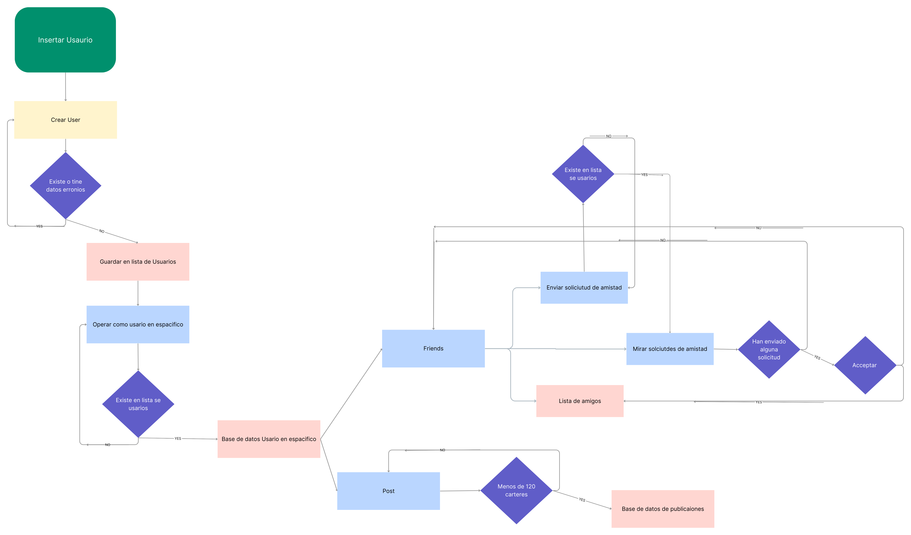

# YeahBuddy
Por: Martí Girón, Arnau Carbonell y Roger Guiñón<br/><hr/>
YeahBuddy es la red social por y para amantes del fitness que necesitas!
## Contenidos
- Introducción
- Objetivos del proyecto
- Solución
- Referencias
## Introducción
Cuando empezamos con este proyecto, no sabíamos qué haría a nuestra red social diferente. No sabíamos cuál sería el tema o qué la haría útil o divertida. Así que preguntamos a Chat GPT. Tan pronto como leímos sus propuestas, lo supimos inmediatamente: una red social de fitness. A los tres nos encanta el gimnasio y el fitness en general así que era la idea perfecta. Además, es una idea bastante original ya que aún no hay aplicaciones grandes o conocidas que hagan eso. Inicialmente, pensamos que sería buena idea que los usuarios pudieran encontrar gente con la que entrenar cerca, aún que esto no se ha podido acabar de implementar. Lo que sí hemos conseguido es crear una red donde los usuarios pueden hacer un seguimiento de su progreso y publicar sus avances en el ámbito del fitness y conocer a personas fantásticas en el proceso.
## Objetivos del proyecto
### Objetivos obligatorios
- **Implementación de una cola, lista y pila.**
Uno de los objetivos obligatorios que se requería era el de implementar al menos una cola, lista y pila para alguna funcionalidad del proyecto. Hemos conseguido implementar las tres y así es cómo:<br/><br/>
    - Empleamos una **cola** para gestionar las peticiones de amistad de los usuarios. Cada usuario tiene una cola de solicitudes propia así que la añadimos a la estructura `User` y lo hacemos como un array de usuarios: `struct _user** requestsQueue`. `User` también debe almacenar información sobre el primero en esta cola y su tamaño, así que añadimos en `User`, `struct _user* requests_first` y `int requests_size`. Una vez terminamos con esto, debemos añadir las funciones básicas de una cola. Éstas son `requests_init_queue()`, `requests_is_empty()`, `requests_enqueue()` y `requests_dequeue()` y, finalmente, una función para mostrar todas las peticiones `requests_print()`. Los nombres explican con bastante acierto lo que hace cada función pero estas son las explicaciones con un poco más de detalle, incluyendo sus argumentos y tipo de retorno. Ver en profundidad en `friends.h` y `friends.c`.
        - `void requests_init_queue(User* user)` inicializa la cola de `user`.
        - `bool requests_is_empty(User* user)` comprueba si la cola de `user` está vacía.
        - `void requests_enqueue(User* user, User* new_friend)` añade una petición de amistad de `new_friend` al final de la cola de `user`.
        - `void requests_dequeue(User* user)` elimina la primera petición de la cola de `user`.
        - `void requests_print(User* user)` imprime las solicitudes una a una y permite a `user` aceptar o rechazarlas.<br/><br/>
    - Usamos una **lista**, concretamente una **lista enlazada**, para almacenar los amigos de un usuario. Como cada usuario tiene su propia lista de amigos, se añade en la estructura `User` un puntero con el primer amigo de la lista, que apuntará al siguiente (inicialmente NULL) y así hasta que no haya más amigos en la lista. Para ello, creamos el nodo `friendsNode` que representa un amigo del usuario. Este nodo incluye el nombre de usuario del amigo (`char username[MAX_LENGTH]`) y un puntero hacia el siguiente amigo de la lista (`struct friendsNode* next`). Con esto, ya tenemos la estructura básica de nuestra lista de amigos. Las funciones empleadas para trabajar y modificar esta lista son `add_friend()` y `print_friends_list()`. De nuevo, explicamos con más detalle estas funciones. Ver en profundidad en `friends.h` y `friends.c`.
        - `void add_friend(User* user, User* sender)` añade a `sender` a la lista de amigos de `user` y viceversa, siendo `sender` el usuario que envió la solicitud de amistad y `user` el que la aceptó.
        - `void print_friends_list(User* user)` imprime la lista de amigos de `user`.<br/><br/>
    - La **pila** la utilizamos para las publicaciones. Cada usuario tiene una pila de publicaciones que definimos como `postStack`. Esta pila incluye un array de publicaciones (`char** posts`) y un entero que marca el elemento "de más arriba" de la pila (`int top`). Creamos las funciones básicas de una pila: `posts_init_stack()`, `posts_is_empty()`, `push_post()` y `pop_post()`, adicionalmente, usamos una función `save_post()` para guardar las publicaciones en un archivo `.txt`. Ver en profundidad en `posts.h` y `posts.c`.
        - `postStack* posts_init_stack()` crea una pila vacía y la devuelve. Lo hacemos así para incluir la pila nada más se crea un usuario. `new_user->posts = posts_init_stack()` en la función `create_user()`.
        - `bool posts_is_empty(postStack* stack)` comprueba si `stack` está vacío. Si lo está, devuelve `true`, sino `false`.
        - `void push_post(postStack* stack, char* post, Dictionary * dictionary)` añade `post` "arriba" de `stack`. 
        - `void pop_post(postStack* stack)` borra la publicación que se encuentra en `stack->top`.
        - `void save_post(char* post, User * user, char* filename)` guarda `post` en un archivo `.txt`. También guarda el nombre de usuario de `user` y la fecha y hora de publicación.<br/><br/>
- **Implementación del algoritmo de búsqueda LinearSearch.**
Otro de los objetivos que se requerían era la implementación de un algoritmo de búsqueda, ya sea LinearSearch o BinarySearch. Nosotros empleamos el algoritmo de LinearSearch en la función `User* search_user(char* username, userArray* array)` que busca el nombre de usuario `username` en el array de usuarios `array` de forma lineal y devuelve el usuario con dicho `username`.  Usamos LinearSearch ya que el array de usuarios no está ordenado. Cada vez que se añade un usuario, se añade a la última posición del array sin tener en cuenta el orden alfabético o cualquier otro tipo de orden, por lo que no se puede usar un algoritmo como BinarySearch, que lo requiere.
La función `search_user()`, que incluye este algoritmo, es imprescindible para el correcto funcionamiento del programa. La usamos para saber con qué usuario estamos operando, para verificar si un usuario existe o para buscar un usuario concreto y visitar su perfil.
Las posibles limitaciones de este algoritmo de búsqueda es el tiempo de ejecución en caso de que el array de usuarios crezca mucho.
Ver en profundidad en `user.c:25`.<br/><br/>
- **Implementación del algoritmo de ordenamiento BubbleSort.**
Además del algoritmo de búsqueda LinearSearch se pedía implementar un algoritmo de ordenación de los que hemos visto durante el curso. Entre ellos se encuentra BubbleSort, que es el que hemos implementado.<br/><br/>
- **Implementación de un diccionario.**
...<br/><br/>
- **Comentarios**
El código incluye comentarios en las partes que consideramos que necesitan una explicación o que no son tan legibles a simple vista. Los comentarios facilitan mucho la labor del programador, en este caso nosotros, en caso de querer modificar algún fragmento del código en un futuro.
### Objetivos deseables
- **Lectura de datos de una fuente externa .txt.**
El primer objetivo deseable pedía implementar la posibilidad de leer datos de una fuente externa como por ejemplo un archivo de texto. Hemos implementado esto para diferentes funcionalidades del código, concretamente, para leer datos de los usuarios y de las publicaciones.
Tenemos un archivo `users.txt` donde se almacenan datos de los usuarios y otro archivo `posts.txt` donde se almacenan datos sobre las publicaciones de los usuarios. La función `import_data()` lee e importa los datos de ambos archivos para que puedan ser utilizados. Usamos también una función auxiliar `line_count()`. Así es como funcionan. Ver en profundidad en `data.h` y `data.c`.
    - `int line_count(char* filename)` cuenta el número de líneas de `filename`. Para ello abre `filename` en modo lectura y cada vez que se encuentra con un `\n`, añade 1 a `lines`. En caso de error abriendo el archivo, devuelve 0 y, si todo va bien, devuelve el número de líneas `lines`.
    - `void import_data(userArray* array, char* users_filename, char* posts_filename, Dictionary* dictionary)` lee e importa los datos de `users_filename` y de `posts_filename`. Abre `users_filename`, que incluye datos de usuarios con un solo usuario en cada línea del archivo, en modo lectura y lee y guarda los datos de cada usuario siguiendo el formato suguiente:
         ```C
         fscanf(fp, "%d %s %s %s %[^-]%*c", &id, username, name, mail_adress, description);
         fscanf(fp, "%d %d %d %d %d %d %d %d %d", &age, &sex, &body_weight, &height, &city_id, &gym_id, &workout_days, &time_preference, &muscle_preference);
         ```
      Para saber cuántos usuarios hay en el archivo, usamos la función `line_count()` que nos dice el número de líneas de `users_filename`, que es equivalente al número de usuarios. Luego crea un nuevo usuario y le asigna los datos correspondientes. Algo parecido hace con `users_filename`, pero en vez de usuarios, procesa publicaciones.

- **Personalización de la red social.**
Como ya hemos explicado anteriormente, nuestra red social se basa en la comunidad fitness y es un lugar para conectar con otras personas que vayan al gimnasio o practique tu misma disciplina en ese mundillo. Así que la temática y personalización es precisamente esa. Podemos ver aspectos de la personalización cuando creamos un nuevo usuario. Verás que se piden cosas como tu estilo de entrenamiento, días que puedes entrenar, grupos musculares favoritos y mucho más. Podemos ver más sobre esto en `preferences.h`.
Todo esto hace nuestra red social única y enfocada en su temática: el fitness.
### Objetivos libres
- **Capa estética.**
Si bien es verdad que crear una interfaz cómoda, agradable y fácil de usar por consola no es una tarea sencilla, hemos hecho el esfuerzo de hacerlo lo más intuitivo y bonito posible. Para empezar, nada más ejecutar, tienes una "pantalla de bienvenida" con el logo de la aplicación. Ver `logo.c`. Desde aquí, no irás a ningún lado hasta que introduzcas un carácter cualquiera y le des a ENTER. 
Para hacer más legible y bonito el menú, añadimos líneas de separación usando la función `print_line()` (ver `interface.c:10`) que dado un entero `i`, imprime en pantalla una línea de `i` guiones '-' con un salto de línea al principio y al final. Esto, cuando le das como parámetro la constante `SEPARATION_LINE_LENGTH`, crea separaciones entre los menús que hacen que el usuario no se pierda en el programa y mantienen un orden. Ver `menu.c:153` para un ejemplo de su implementación.
El perfil de los usuarios también tiene un formato que lo hace algo más bonito. Podéis ver la función `print_user_info()` en `interface.c:49`.
Todo esto pensado para hacer la estancia de los usuarios en YeahBuddy lo más agradable posible.<br/><br/>

- **Lectura y guardado de datos**
Hemos implementado funciones de guardado de datos a archivos `.txt` como `save_user()`  y `save_post()` que almacenan datos en archivos `.txt` que después de pueden leer e importar usando `import_data()`. Ver en detalle en `data.c:100`.
    - `void save_user(User* user, char* filename)` abre `filename` en modo 'append' y escribe los datos de `user` en la siguiente línea disponible del archivo con el siguiente formato:
    ```C
    fprintf(fp, "\n%d %s %s %s %s- %d %d %d %d %d %d %d %d %d", lines, user->username, user->name, user->mail_adress, user->description, user->age, user->sex, user->body_weight, user->height, user->city_id, user->gym_id, user->workout_days, user->time_preference, user->muscle_preference);
    ```
    - `void save_post(char* post, User* user, char* filename)` abre `filename` en modo 'append' y almacena los datos de `post` en en la siguiente línea disponible del archivo con el formato especificado más abajo. También usa funciones de la librería `<time.h>` para guardar la hora y fecha de la publicación y guarda el nombre de usuario de `user`, que es el autor. Lo hace siguiendo el siguiente formato:
    ```C
    fprintf(fp, "\n%d. [%s] %s %d:%d {%s}", lines, user->username, actual_date, times->tm_hour + 2, times->tm_min, post);
    ```
## Solución
### Arquitectura del sistema
YeahBuddy es una red social orientada al mundo del fitness y el deporte. Permite a los usuarios compartir publicaciones, añadir amigos, hacer un seguimiento de su progreso, etc. Al ser un proyecto relativamente extenso, puede ser fácil perderse entendiendo el código o sus funcionalidades, así que describiremos el funcionamiento y uso de los bloques principales que comportan el proyecto.

- **Usuarios (`user.h` y `user.c`):**
Este primer bloque se encarga de la gestión de usuarios, incluyendo el registro, búsqueda y demás operaciones. Cada usuario se almacena en una estructura de datos `User`, que contiene información del usuario como su nombre, edad, sexo, lista de amigos, publicaciones y otras preferencias relacionadas con el fitness. Además, cada estructura `User` se almacena a su vez en un array de usuarios `userArray`, que almacena los usuarios y una entero `size` que marca el tamaño del array.
Este bloque incluye funciones para añadir y buscar usuarios y verificar la validez de los datos de los usuarios. También se utilizan otros módulos, como el de publicaciones y el de amigos, para gestionar la información relacionada con los usuarios.<br/><br/>
- **Amigos (`friends.h` y `friends.c`):**
Este bloque se encarga de las operaciones relacionadas con la gestión de amistades entre usuarios. Permite enviar y aceptar solicitudes de amistad, y mantener una lista enlazada de amigos para cada usuario que se define con `friendsNode` en `user.h:8`.
Las solicitudes de amistad se gestionan mediante una cola, de la que ya hemos hablado anteriormente.<br/><br/>
- **Publicaciones (`posts.h` y `posts.c`):**
Se encarga de la gestión de las publicaciones de los usuarios. Cada usuario tiene una pila de publicaciones que se define como `postStack` en `posts.h:12`. Permite crear y añadir publicaciones a la pila, eliminarlas y otras operaciones relacionadas con la gestión de publicaciones. Cada publicación se representa como una cadena de caracteres `char*` y se guarda en la pila del usuario correspondiente.<br/><br/>
- **Diccionario (`dict.h` y `dict.c`):**
El diccionario se utiliza para almacenar palabras y contar su frecuencia en las publicaciones. Permite realizar operaciones como agregar palabras, buscar palabras y obtener la frecuencia de una palabra específica. El diccionario se define como `Dictionary` en `dict.h:11` y los pares llave-valor como `Pair` en `dict.h:6`.<br/><br/>
- **Menús (`menu.h` y `menu.c`)**
Este bloque implementa una interfaz para que los usuarios interactúen con el sistema. Permite realizar acciones como el registro de nuevos usuarios, inicio de sesión, creación de publicaciones, búsqueda de usuarios, gestión de amistades y visualización de información relacionada con los usuarios.
Para ello, utiliza las funciones proporcionadas por los módulos anteriores para realizar las diversas operaciones y mostrar los resultados al usuario. Se basa en la interacción con el usuario para recopilar la entrada y proporcionar salidas adecuadas.<br/><br/>
- **Gestión y almacenamiento de datos (`data.h` y `data.c`):**
Este último bloque se encarga de la gestión de guardado y uso de datos de ficheros `.txt`. Tanto la información de los usuarios como las publicaciones se guardan en archivos `.txt` con las funciones `save_user()` y `save_post()` y se importan desde esos archivos para usar con la función `import_data()`.
### Gestión de errores
La gestión de errores en el código se puede ver en varias funcionalidades y funciones.
Una de las más importantes se encuentra en la función `create_user()` del archivo `user.c`que verifica si el nombre de usuario o la dirección de correo electrónico ya están en uso antes de crear un nuevo usuario. Al verificar la existencia previa de nombres de usuario y direcciones de correo electrónico, se evita la duplicación de información y se garantiza que cada usuario tenga un identificador único. Esto contribuye a la integridad de los datos y evita conflictos en futuras operaciones que involucren usuarios.
Relacionado con esto, incluimos una función `check_data()` dedicada específicamente a comprobar la validez del nombre de usuario y correo electrónico del usuario. Esta validación se realiza para asegurarse de que los datos ingresados por el usuario cumplan con ciertos criterios, como la longitud mínima, el formato de correo electrónico válido y la ausencia de espacios en blanco.
También tenemos control de errores de asignación de memoria en funciones como `init_array()` y `create_user()`, donde se realiza una verificación después de asignar memoria dinámicamente para asegurarse de que la asignación de memoria fue exitosa. En caso de una asignación fallida, se muestra un mensaje de error y se toman las medidas adecuadas, como liberar memoria previamente asignada y notificar al usuario sobre la situación.
Por último, en la función `search_user()` del archivo `user.c`, se retorna `NULL` si no se encuentra un usuario con el nombre de usuario especificado con la idea de proporcionar una forma clara de indicar que la búsqueda no tuvo éxito. Esto permite a otras partes del programa manejar este caso y tomar decisiones apropiadas en función de la existencia o ausencia de un usuario.
### Flujo de datos
El flujo de datos en el proyecto sigue un ciclo general que involucra la entrada, procesamiento y salida de datos. A continuación, se describe el flujo de datos en el proyecto:

1. **Entrada de datos:**
Los datos de entrada en el proyecto provienen de diversas fuentes, como la interacción del usuario con el programa o la lectura de archivos externos.
Por ejemplo, los datos de entrada pueden incluir el nombre de usuario y la contraseña ingresados por el usuario al iniciar sesión, los datos de un nuevo usuario registrado o los datos leídos de archivos que contienen información relevante.<br/><br/>
2. **Procesamiento de datos:**
Una vez que los datos de entrada son adquiridos, se procesan y manipulan para llevar a cabo diversas operaciones y cálculos.
El procesamiento de datos puede incluir la validación de la información ingresada por el usuario, la aplicación de reglas de negocio para determinar acciones a tomar, la ejecución de algoritmos o la realización de cálculos basados en los datos disponibles.
Por ejemplo, se pueden realizar operaciones como la creación de un nuevo usuario en la estructura de datos correspondiente, la búsqueda y recuperación de información relevante, la actualización de perfiles de usuario o la generación de informes y estadísticas.<br/><br/>
3. **Salida de datos:**
Una vez que los datos se han procesado, se proporciona una salida para mostrar los resultados al usuario o almacenarlos en archivos.
La salida de datos puede incluir la visualización de información en la interfaz de usuario, la generación de informes en formato legible o la escritura de datos en archivos para su posterior uso.
Por ejemplo, los resultados de una búsqueda de usuarios pueden mostrarse en la pantalla, los informes generados pueden guardarse en archivos de texto o los datos actualizados pueden almacenarse en una base de datos.
El flujo de datos en el proyecto se repite y se adapta a las diferentes funcionalidades y requerimientos del sistema. Los datos fluyen de la entrada al procesamiento y finalmente a la salida, permitiendo la interacción con el usuario y la manipulación de la información de manera eficiente y estructurada<br/><br/>

## Referencias
Chat GPT de OpenAI - https://chat.openai.com/<br/>
Microsoft C docs - https://learn.microsoft.com/en-us/cpp/c-language/?view=msvc-170